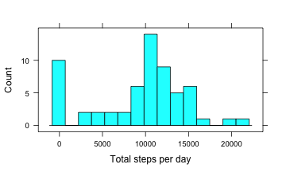
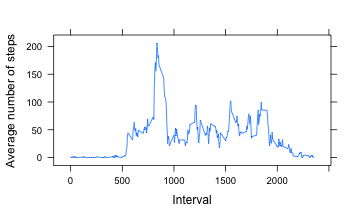
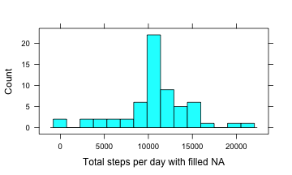
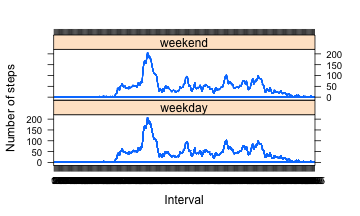

## Project 1

### Introduction

This data is from a personal activity monitoring device which collects data at 5 minute intervals through out the day. The data consists of two months of data from an anonymous individual collected during the months of October and November, 2012 and include the number of steps taken in 5 minute intervals each day.

The data is downloaded from the course web site:
Dataset: Activity monitoring data


```r
knitr::opts_chunk$set(fig.width=5, fig.height=3) 
```


```r
library(lattice)
library(dplyr)
```


```r
data <- read.csv("activity.csv")
```
The dataset contains 17568 observations and 3 variables:
        **steps**: Number of steps taking in a 5-minute interval (missing values are coded as NA);
        **date**: The date on which the measurement was taken in YYYY-MM-DD format;
        **interval**: Identifier for the 5-minute interval in which measurement was taken

### The total number of steps per day

I summed the number of steps per day (61 days). Here is the histogram of the total number of steps taken each day.

```r
steps_day <- tapply(data$steps, data$date, sum, na.rm=TRUE)
histogram(steps_day, nint=15, type="count", xlab="Total steps per day")
```




```r
mean_st <- mean(steps_day)
```

The mean of the total number of steps taken per day is 9354.2295082 .


```r
median_st <- median(steps_day)
```

And the median of the total number of steps taken per day is 10395 .

### Average daily activity pattern

I calculated the average number of steps taken in each interval across all days created a plot of the 5-minute interval and the average number of steps taken, averaged across all days.


```r
data$interval <- as.factor(data$interval)
steps_int <- tapply(data$steps, data$interval, mean, na.rm=TRUE)
lvl <- as.integer(levels(data$interval))
df <- data.frame(lvl, steps_int)
df <- arrange(df,lvl)
xyplot(steps_int~lvl,df, type="l", xlab="Interval", ylab="Average number of steps")
```




```r
maxsteps_int <- df[1][df$steps_int %in% c(max(steps_int)),]
```

The interval containing the maximum number of steps is 835 .

### Imputing missing values


```r
total_na <- sum(is.na(data$steps))
```

Total number of missing values is 2304 .

I decided to replace the missing values in variable "steps" with the mean for that 5-minute interval. In order to do it I created a new variable "gr_mean" containing the means values for the intervals. The new vector "full_steps" contains the values of "steps" with replaced NA and data frame "data_full" is "data" with "full_steps" added to it.


```r
data_g <- data %>% group_by(interval) %>% mutate(gr_mean=mean(steps, na.rm=TRUE))
full_steps <- ifelse(!is.na(data_g$steps), data_g$steps, data_g$gr_mean)
data_full <- data.frame(full_steps, data)
data_full <- select(data_full, -c(steps))
```

The new data frame with filled values "data_full" looks like this:


```r
head(data_full)
```

```
##   full_steps       date interval
## 1  1.7169811 2012-10-01        0
## 2  0.3396226 2012-10-01        5
## 3  0.1320755 2012-10-01       10
## 4  0.1509434 2012-10-01       15
## 5  0.0754717 2012-10-01       20
## 6  2.0943396 2012-10-01       25
```

And here is the histogram of total number of steps taken per day with the missing data filled in.


```r
fullst_day <- tapply(data_full$full_steps, data_full$date, sum)
histogram(fullst_day, nint=15, type="count", xlab="Total steps per day with filled NA")
```




```r
mean_fullst <- mean(fullst_day)
```

The mean of the total number of steps taken per day is 1.0766189 &times; 10<sup>4</sup> .


```r
median_fullst <- mean(fullst_day)
```

The median of the total number of steps taken per day is 1.0766189 &times; 10<sup>4</sup> .

The values from data with filled NA's differ from the values from data with NA's. We can see this in the table here.


```r
tab <- data.frame("Mean"=c(mean_st, mean_fullst), "Median"=c(median_st, median_fullst), row.names = c("Steps", "Full steps") )
tab
```

```
##                Mean   Median
## Steps       9354.23 10395.00
## Full steps 10766.19 10766.19
```

### Differences in activity patterns between weekdays and weekends

I replaced the dates in variable "date" with the days of the week and created a new factor variable in the dataset with levels "weekday" and "weekend".


```r
w_days <- weekdays(as.Date(data_full$date))
days <- as.factor(ifelse(w_days=="Saturday"|w_days=="Sunday", "weekend", "weekday"))
data_full <- cbind(data_full, days)
head(data_full)
```

```
##   full_steps       date interval    days
## 1  1.7169811 2012-10-01        0 weekday
## 2  0.3396226 2012-10-01        5 weekday
## 3  0.1320755 2012-10-01       10 weekday
## 4  0.1509434 2012-10-01       15 weekday
## 5  0.0754717 2012-10-01       20 weekday
## 6  2.0943396 2012-10-01       25 weekday
```

Here is a plot containing a time series plot of the 5-minute interval and the average number of steps taken, averaged across all weekday days or weekend days. 


```r
data_full <- data_full %>% group_by(interval) %>% mutate(full_mean=mean(full_steps))
xyplot(data_full$full_mean~data_full$interval | data_full$days, layout=c(1,2), type="l", xlab="Interval", ylab="Number of steps")
```



